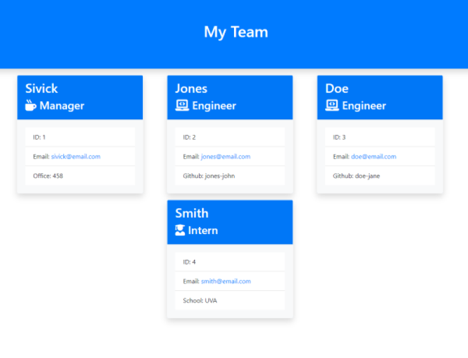
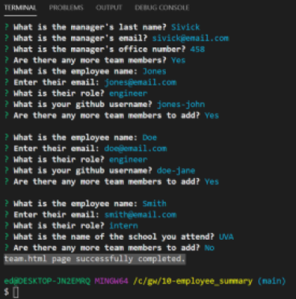
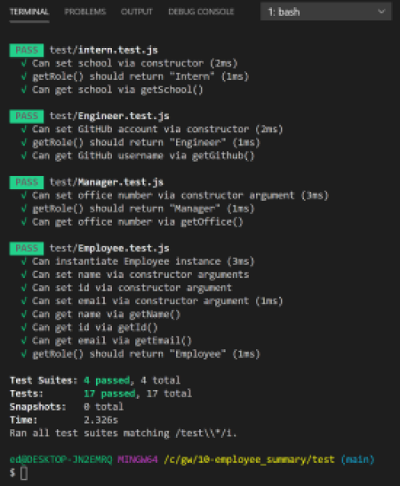

# Employee Summary - Template Engine  
___
## Objective
Build a Node CLI that takes in information about employees and generates an HTML webpage that displays summaries for each person.  Also, ensure that all unit tests pass.
___
## Table of Contents
* [Description](#description)
* [Installation](#installation)
* [Usage](#usage)
* [License](#license)
* [Contributing](#contributing)
* [Tests](#tests)
* [Questions](#questions)
* [Application_Links_and_Images](#application_links_and_images)
## Description:
 This is a command-line app that dynamically generates an employee team summary webpage based on user responses.
_____
## Layout:
The application, **app.js**, will prompt the user for information about the team manager and then information about the team members. The user can input any number of team members, and they may be a mix of **engineers** and **interns**. The app must also pass all unit tests (**Employee.test.js, Engineer.test.js, intern.test.js, Manager.test.js**). When the user has completed building the team, the application will create an HTML file, **team.html**, that displays a nicely formatted team roster based on the information provided by the user. The dependencies are, [jest](https://jestjs.io/) for running the provided tests, and [inquirer](https://www.npmjs.com/package/inquirer) for collecting input from the user.  
HTML templates for each type of user are created to build the final **team.html** file:
- engineer.html
- intern.html
- main.html
- manager.html
___
## Installation
(1) Type **npm i** (install) to install inquirer module, and all related dependencies   
(2) Invoke the app by going to the app.js file, open in integrated terminal, and type: **node app.js**   
(3) Provide responses at the prompts   
_____
## Usage
This App gathers pertinent employee information to organize, and create a team summary webpage. 
_____
## Contributing
ed-sivick, Grepper, and Stack Overflow user resources for functionality and syntax
_____
## Tests
Go to test folder, open in integrated terminal, and type: **npm run test** to complete testing for:
- employee.test.js
- engineer.test.js
- intern.test.js
- manager.test.js
_____
## Questions
If there are any questions, or if you would prefer more information concerning this app,
please contact the following person at their GitHub profile or email address below:

* [GitHub Profile](https://github.com/ed-sivick)
* ed@sivick.net
_____
## License
You can view more information concerning software licenses at the following link:

* [License](https://opensource.org/licenses/MIT)
_____
## Badges

___
## Application_Links_and_Images  
**Links:**  
Walkthrough Videos, app.js and run tests (MP4): (https://drive.google.com/drive/folders/1NYOUC753-tOwGsph15YaXhfiIKLf0WlD)   

**Application Image Examples:** Hover the mouse over each image for a brief description.

  
  

  
  

  
  

  

  
  
